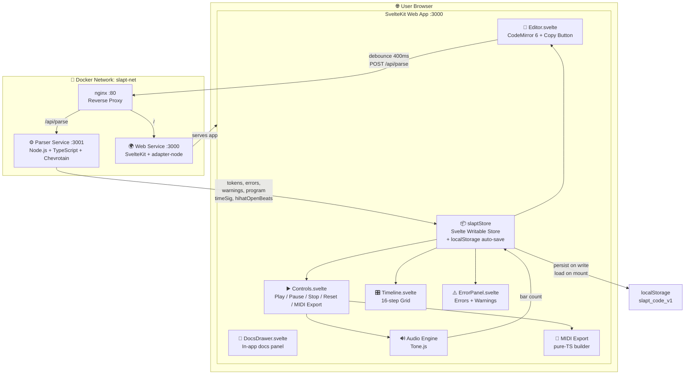
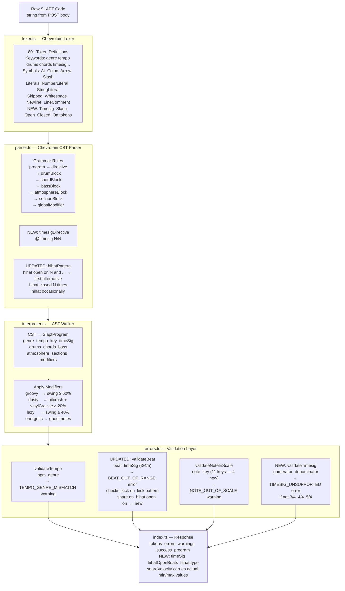
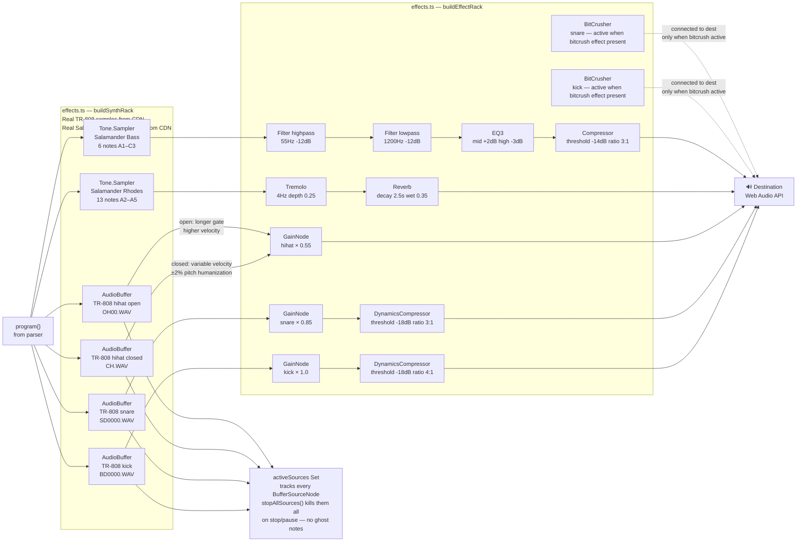
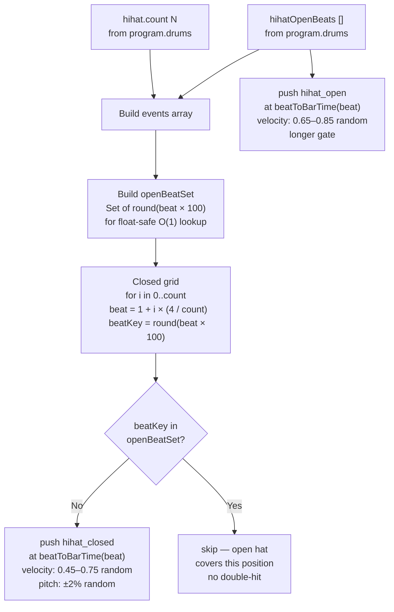
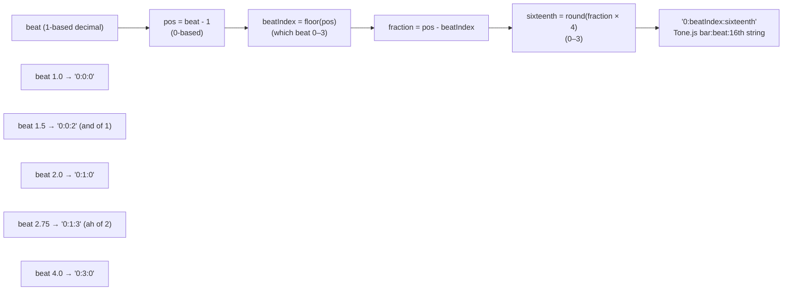
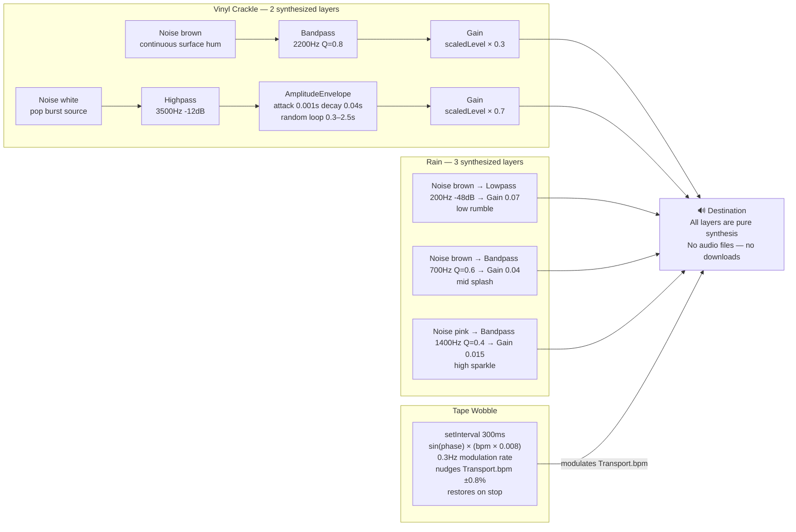
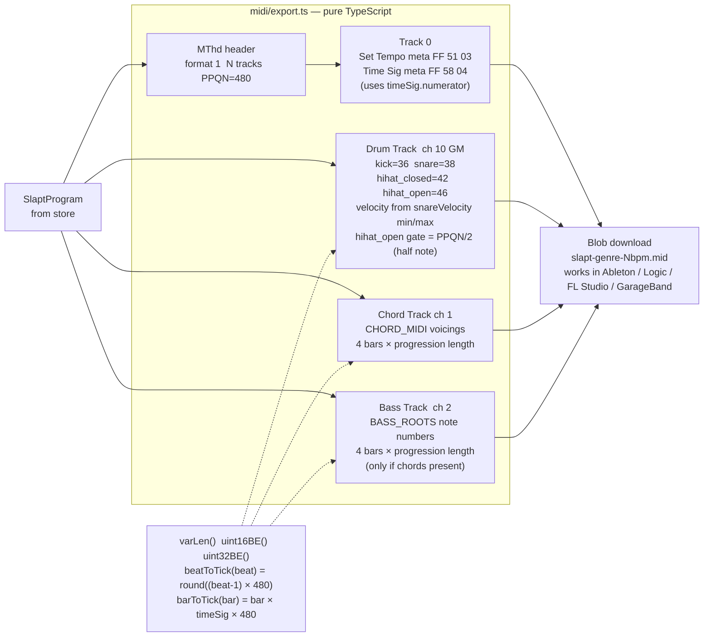
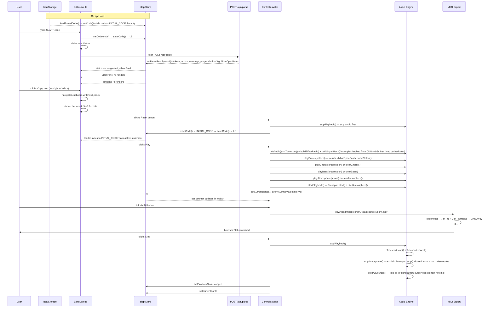
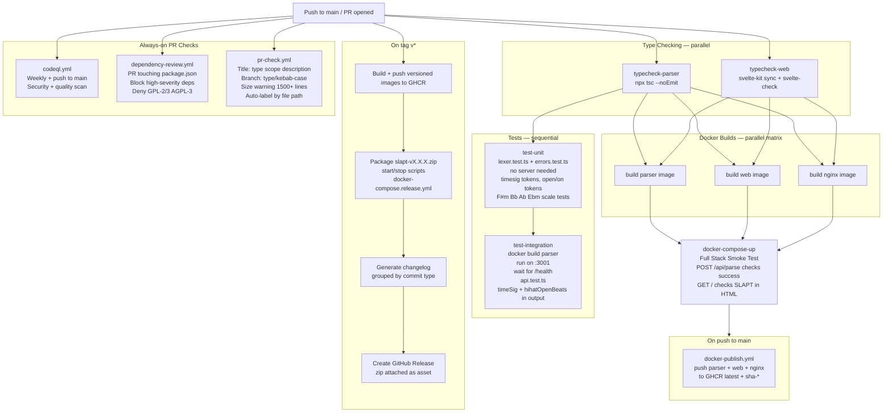

# SLAPT Documentation

> **S**ounds **L**ike **A** **P**erfect **T**rack  
> *(Sonic Language Audio Programming Tool if your parents are asking)*

---

## Table of Contents

1. [Architecture Overview](#architecture-overview)
2. [System Architecture Diagram](#system-architecture-diagram)
3. [Parser Pipeline](#parser-pipeline)
4. [Audio Engine Signal Chain](#audio-engine-signal-chain)
5. [Frontend State Flow](#frontend-state-flow)
6. [CI/CD Pipeline](#cicd-pipeline)
7. [Directory & File Architecture](#directory--file-architecture)
8. [Running SLAPT](#running-slapt)
9. [Tagging a Release](#tagging-a-release)
10. [Parser Service API](#parser-service-api)
11. [Validation Rules](#validation-rules)
12. [SLAPT Language Reference](#slapt-language-reference)
13. [Audio Engine](#audio-engine)
14. [Web Service](#web-service)
15. [CI/CD & GitHub Workflows](#cicd--github-workflows)
16. [Environment Variables](#environment-variables)

---

## Architecture Overview

SLAPT runs as **three Docker services** orchestrated via `docker-compose.yml`. The parser is a stateless REST service. The web frontend does all audio synthesis entirely client-side via Tone.js. nginx is the single entry point.

---

## System Architecture Diagram



---

## Parser Pipeline



---

## Audio Engine Signal Chain

### Drum & Instrument Routing



### Open Hihat Logic



### Beat Timing — beatToBarTime



### Atmosphere Routing



### MIDI Export Pipeline



---

## Frontend State Flow



---

## CI/CD Pipeline



---

## Directory & File Architecture

```
SLAPT/
│
├── .env                              # Single root config: ports, PARSER_URL, NODE_ENV
├── docker-compose.yml                # Dev: builds all 3 services from local source
├── docker-compose.release.yml        # Prod: pulls pre-built images from GHCR
├── Taskfile.yml                      # Task runner: docker, dev, install, build,
│                                     #   test, typecheck, health, cleanup commands
├── start.bat / start.sh              # One-click launch scripts for Windows / Mac+Linux
├── stop.bat  / stop.sh               # One-click stop scripts
│
├── .github/
│   ├── labeler.yml                   # Auto-labels PRs by changed file paths
│   │                                 #   parser, web, audio, tests, docs, ci, docker, deps
│   ├── PULL_REQUEST_TEMPLATE.md      # PR checklist: type, how-to-test, task checklist
│   │
│   ├── ISSUE_TEMPLATE/
│   │   ├── bug_report.yml            # Structured bug form: what/error/service/OS/Docker
│   │   └── feature_request.yml      # Feature form: problem/syntax idea/area/roadmap phase
│   │
│   └── workflows/
│       ├── ci.yml                    # Main CI: typecheck → unit tests → integration
│       │                             #   tests → docker builds → full stack smoke test
│       ├── pr-check.yml              # PR gate: title lint, branch name, size warning,
│       │                             #   auto-label via labeler.yml
│       ├── docker-publish.yml        # Builds and pushes all 3 images to GHCR on main
│       ├── release.yml               # On tag v*: versioned images, release zip,
│       │                             #   grouped changelog, GitHub Release
│       ├── codeql.yml                # Weekly + on-push CodeQL security + quality scan
│       └── dependency-review.yml     # On PR: block high-severity, deny GPL licenses
│
├── nginx/
│   ├── Dockerfile                    # FROM nginx:1.25-alpine, copies nginx.conf
│   └── nginx.conf                    # /api/parse → parser:3001, / → web:3000,
│                                     #   WebSocket upgrade headers
│
├── services/
│   │
│   ├── parser/                       # Stateless REST parser service
│   │   ├── Dockerfile                # Multi-stage: tsc compile → slim Alpine runtime
│   │   ├── tsconfig.json             # ES2020, commonjs, strict, sourceMap, declarations
│   │   └── src/
│   │       ├── index.ts              # Express server entry point:
│   │       │                         #   POST /api/parse — lex, parse, validate, build program
│   │       │                         #   GET /health
│   │       │                         #   Beat validation across all 4 sources:
│   │       │                         #     kick on / kick pattern / snare on / hihat open on
│   │       │                         #   @timesig parsing → TIMESIG_UNSUPPORTED error
│   │       │                         #   effectiveBeats from timeSig passed to validateBeat
│   │       │                         #   hihatOpenBeats extracted into program output
│   │       │                         #   snareVelocity carries actual {min, max} values
│   │       ├── lexer.ts              # Chevrotain token definitions (80+ tokens):
│   │       │                         #   NEW: Timesig keyword token
│   │       │                         #   NEW: Slash token (for N/N syntax)
│   │       │                         #   NEW: Closed, Open tokens for hihat patterns
│   │       │                         #   longer_alt: Identifier so keywords take priority
│   │       ├── parser.ts             # Chevrotain CST grammar rules:
│   │       │                         #   NEW: timesigDirective rule (@timesig N/N)
│   │       │                         #   UPDATED: hihatPattern — hihat open on N and ...
│   │       │                         #     as first alternative (ordered choice matters)
│   │       │                         #     before hihat closed N times / hihat N times
│   │       ├── ast.ts                # TypeScript AST node type definitions:
│   │       │                         #   Program, DrumBlock, ChordBlock, BassBlock,
│   │       │                         #   AtmosphereBlock, SectionBlock, ModifierStatement
│   │       │                         #   VelocityRange carries min + max numbers
│   │       ├── interpreter.ts        # Walks CST → SlaptProgram output object:
│   │       │                         #   FIX: snareVelocity carries {min, max} not boolean
│   │       │                         #   applies modifier side-effects
│   │       └── errors.ts             # Validation functions:
│   │                                 #   validateTempo, validateBeat, validateNoteInScale
│   │                                 #   NEW keys: F#m, Ebm, Bb, Ab (11 total)
│   │                                 #   GENRE_BPM_RANGES, SCALE_NOTES tables
│   │
│   └── web/
│       ├── Dockerfile                # Multi-stage: svelte-kit sync + vite build → runtime
│       ├── svelte.config.js          # adapter-node, vitePreprocess
│       ├── vite.config.ts            # Port 3000, tone as SSR external
│       ├── tsconfig.json             # ESNext, strict, $lib path alias
│       └── src/
│           ├── app.html              # HTML shell: Google Fonts (Space Mono, Bebas Neue,
│           │                         #   DM Sans), SvelteKit body injection
│           ├── app.css               # CSS custom properties: colors, fonts, radius, shadows
│           │
│           ├── types/
│           │   └── slapt.d.ts        # Shared interfaces:
│           │                         #   ParseResult, SlaptProgram, SlaptStore
│           │                         #   DrumProgramOutput, ChordProgramOutput
│           │                         #   AtmosphereProgramOutput, PlaybackState
│           │                         #   NEW: TimeSig { numerator, denominator }
│           │                         #   NEW: hihatOpenBeats field on DrumProgramOutput
│           │                         #   NEW: timeSig field on SlaptProgram
│           │                         #   FIX: snareVelocity { min, max } not boolean
│           │
│           ├── lib/
│           │   ├── api/
│           │   │   └── parser.ts     # fetch() wrapper: POST /api/parse → ParseResult
│           │   │
│           │   ├── audio/
│           │   │   ├── engine.ts     # Public audio API:
│           │   │   │                 #   initAudio, playDrums, clearDrums
│           │   │   │                 #   playChords, clearChords
│           │   │   │                 #   playBass, clearBass
│           │   │   │                 #   playAtmosphere, clearAtmosphere
│           │   │   │                 #   startPlayback, stopPlayback, pausePlayback
│           │   │   │                 #   setTempo, setBarChangeCallback, cleanup
│           │   │   │                 #   samplesReady / samplesLoading flags for UI
│           │   │   │                 #   clear* functions prevent stale part bleed-through
│           │   │   │
│           │   │   ├── scheduler.ts  # Tone.js scheduling:
│           │   │   │                 #   CRITICAL FIX: time from Part callback is used
│           │   │   │                 #     directly — not recomputed from rawContext
│           │   │   │                 #   NEW: DrumPattern.hihatOpenBeats field
│           │   │   │                 #   NEW: closed grid skips open-hihat positions
│           │   │   │                 #     Set-based, float-safe ×100 rounding
│           │   │   │                 #   NEW: hihat_open → longer gate, higher velocity
│           │   │   │                 #   beatToBarTime() — beat→"0:B:S" string
│           │   │   │                 #   scheduleChords — CHORD_VOICINGS map
│           │   │   │                 #   scheduleBass — BASS_ROOTS map
│           │   │   │                 #   scheduleAtmosphere — vinyl 2-layer + rain 3-layer
│           │   │   │                 #     + tape wobble setInterval
│           │   │   │                 #   startAtmosphere, stopAtmosphere, disposeAtmosphere
│           │   │   │
│           │   │   └── effects.ts    # Web Audio node construction:
│           │   │                     #   buildEffectRack — per-instrument gain + compressor
│           │   │                     #     bitcrushers, reverb, tremolo, bass filter chain
│           │   │                     #   buildSynthRack — fetches TR-808 drum samples +
│           │   │                     #     Salamander piano/bass samplers from CDN
│           │   │                     #   activeSources Set — tracks BufferSourceNodes
│           │   │                     #   stopAllSources() — ghost note fix
│           │   │                     #   playBuffer() — creates source, adds to Set
│           │   │                     #   applyDrumEffects — lazy bitcrusher routing
│           │   │                     #   disposeEffectRack, disposeSynthRack
│           │   │
│           │   ├── midi/
│           │   │   └── export.ts     # Pure-TypeScript MIDI builder (no dependencies):
│           │   │                     #   exportMidi(program, bars=4) → Uint8Array
│           │   │                     #   downloadMidi(program, filename) → browser download
│           │   │                     #   PPQN = 480, format type 1 (multi-track)
│           │   │                     #   Track 0: tempo meta + time signature meta
│           │   │                     #   Drum track: ch 10 GM
│           │   │                     #     kick=36 snare=38 hihat_c=42 hihat_o=46
│           │   │                     #   Chord track: ch 1, CHORD_MIDI voicings map
│           │   │                     #   Bass track: ch 2, BASS_ROOTS map
│           │   │                     #   Velocity from snareVelocity {min, max} range
│           │   │                     #   varLen() uint16BE() uint32BE() helpers
│           │   │
│           │   ├── components/
│           │   │   ├── Editor.svelte       # CodeMirror 6: oneDark, line numbers,
│           │   │   │                       #   400ms debounced parse, status dot
│           │   │   │                       #   (green=ok yellow=parsing red=error)
│           │   │   │                       #   copy-to-clipboard button top-right
│           │   │   │                       #   internalUpdate flag prevents feedback loop
│           │   │   │                       #   reactive sync for external resets
│           │   │   ├── Controls.svelte     # Play/pause/stop transport:
│           │   │   │                       #   reads program from store
│           │   │   │                       #   passes hihatOpenBeats to playDrums
│           │   │   │                       #   calls clear* when block absent (no bleed)
│           │   │   │                       #   Reset button — stops audio first
│           │   │   │                       #   MIDI export button (disabled on errors)
│           │   │   │                       #   samplesLoading spinner on first play
│           │   │   ├── Timeline.svelte     # 16-step grid (16th-note resolution):
│           │   │   │                       #   beatToStep: round((beat-1) × 4)
│           │   │   │                       #   CSS grid equal columns — no flex quirks
│           │   │   │                       #   beat labels: absolute positioned overlays
│           │   │   │                       #   kick=lime  snare=orange  hihat=cyan
│           │   │   ├── ErrorPanel.svelte   # Errors + warnings: code, line, context,
│           │   │   │                       #   suggestions — only renders when non-empty
│           │   │   └── DocsDrawer.svelte   # NEW: slide-over docs panel (860px wide):
│           │   │                           #   triggered by Docs button in topbar
│           │   │                           #   sidenav with 4 groups + 23 sections
│           │   │                           #   scrollable content, smooth nav
│           │   │                           #   closes on ESC / backdrop click / ✕
│           │   │
│           │   └── stores/
│           │       └── slapt.ts      # Svelte writable store + localStorage:
│           │                         #   STORAGE_KEY = "slapt_code_v1"
│           │                         #   loadSavedCode() — SSR-safe, reads LS on init
│           │                         #   saveCode() — writes on every setCode() call
│           │                         #   resetCode() — INITIAL_CODE → saves → store
│           │                         #   setCode() extracts genre/key/tempo via regex
│           │                         #   INITIAL_CODE includes hihat open on 4
│           │                         #   derived — hasErrors, hasWarnings, isPlaying
│           │
│           └── routes/
│               ├── +layout.svelte    # Root layout: imports app.css
│               └── +page.svelte      # Main page:
│                                     #   topbar: brand + Controls + key badge
│                                     #     + Docs button + GitHub link
│                                     #   sidebar: genre templates + quick modifiers
│                                     #   editor area: Editor + resize handle
│                                     #   bottom panels: ErrorPanel + Timeline
│                                     #   <DocsDrawer bind:open={docsOpen} />
│
└── tests/
    ├── tsconfig.json                 # baseUrl ".." so parser/src imports resolve
    ├── lexer.test.ts                 # Unit: all token types, decimal beats, arrows,
    │                                 #   atmosphere, modifiers, comment skipping
    │                                 #   NEW: timesig token, slash token, open/on tokens
    ├── errors.test.ts                # Unit: validateTempo, validateBeat,
    │                                 #   validateNoteInScale — full edge case coverage
    │                                 #   NEW: hihat open on beat validation
    │                                 #   NEW: timesig-adjusted ranges (3/4, 5/4)
    │                                 #   NEW: F#m, Bb, Ab, Ebm scale note tests
    └── api.test.ts                   # Integration: /health, success, token shapes,
                                      #   warnings, errors, 400 bad request
                                      #   NEW: timeSig field in program output
                                      #   NEW: hihatOpenBeats field in drums output
```

---

## Running SLAPT

### Production (One-Click)

Requires [Docker Desktop](https://www.docker.com/products/docker-desktop/).

```bash
# Windows
start.bat

# Mac / Linux
chmod +x start.sh && ./start.sh
```

Opens `http://localhost` automatically.

### Development (Docker)

```bash
docker-compose up --build
```

### Development (No Docker)

```bash
# Terminal 1 — parser
cd services/parser && npm install && npm run dev   # :3001

# Terminal 2 — web
cd services/web && npm install && npm run dev      # :3000
```

Set `PARSER_URL=http://localhost:3001` in `.env` when running without Docker.

### Task Runner Quick Reference

```bash
task              # list all tasks
task run          # build + start (Docker)
task test:full    # start parser → run all tests → stop
task install      # install all deps
task check        # type-check all services
task clean:all    # remove artifacts + volumes
```

---

## Tagging a Release

The `release.yml` workflow triggers on any tag matching `v*`. It handles everything automatically: building and pushing versioned Docker images to GHCR, packaging the release zip, generating a grouped changelog, and creating the GitHub Release.

```bash
# 1. Ensure main is clean and all CI is green
git checkout main
git pull

# 2. Create and push the version tag
git tag v1.1.0
git push origin v1.1.0
```

That's it. GitHub Actions does the rest. The release will appear at:
`https://github.com/souvik03-136/slapt/releases/tag/v1.1.0`

**To overwrite a tag** (if you need to redo a release):

```bash
# Delete locally and remotely, then re-tag
git tag -d v1.1.0
git push origin :refs/tags/v1.1.0
git tag v1.1.0
git push origin v1.1.0
```

**Commit message convention** (used by the changelog generator):

```
add(scope): description     → ✨ New Features
fix(scope): description     → 🐛 Bug Fixes
docs(scope): description    → 📖 Documentation
refactor(scope): desc       → ♻️ Refactors
perf(scope): description    → ⚡ Performance
test(scope): description    → 🧪 Tests
chore(scope): description   → 🔧 Chores
ci(scope): description      → 👷 CI
```

---

## Parser Service API

### `POST /api/parse`

**Request:**
```json
{ "code": "your slapt code here" }
```

**Response:**
```json
{
  "tokens": [
    { "tokenType": "Genre", "image": "genre", "startLine": 1, "startColumn": 2 }
  ],
  "errors": [
    {
      "code": "BEAT_OUT_OF_RANGE",
      "message": "Beat 5 doesn't exist in 4/4 time",
      "line": 4,
      "column": 12,
      "context": "kick pattern",
      "suggestions": [
        "Beats go from 1 to 4 in your current time signature",
        "Try @timesig 5/4 if you want 5 beats per bar",
        "Did you mean beat 1?"
      ]
    }
  ],
  "warnings": [
    {
      "code": "TEMPO_GENRE_MISMATCH",
      "message": "180 BPM feels off for lofi-hiphop",
      "suggestions": [
        "Typical lofi-hiphop range: 60-90 BPM",
        "Try 75 BPM for a classic lofi-hiphop feel",
        "Or switch genre to match your tempo"
      ]
    }
  ],
  "success": true,
  "program": {
    "genre": "lofi-hiphop",
    "tempo": 75,
    "key": "Am",
    "timeSig": { "numerator": 4, "denominator": 4 },
    "drums": {
      "swing": 60,
      "kick": [1, 2.75, 3],
      "snare": [2, 4],
      "snareVelocity": { "min": 0.7, "max": 0.9 },
      "hihat": { "count": 8, "type": "closed" },
      "hihatOpenBeats": [4],
      "effects": ["bitcrush", "compress"],
      "timeSig": 4
    },
    "chords": {
      "instrument": "piano",
      "progression": ["Am7", "Fmaj7", "Dm7", "E7"],
      "voicing": "spread",
      "rhythm": "whole",
      "effects": []
    },
    "bass": { "style": "walking", "sound": "mellow", "filter": "warm" },
    "atmosphere": { "vinylCrackle": 20, "rain": true, "tapeWobble": false },
    "modifiers": ["dusty"]
  }
}
```

**Response field notes:**
- `success: true` when `errors` is empty. Warnings do not affect `success`.
- `program` is `null` when there are parse errors.
- `timeSig` defaults to `{ numerator: 4, denominator: 4 }` when `@timesig` is omitted.
- `hihatOpenBeats` is `[]` when `hihat open on` is not written.
- `snareVelocity` carries actual `{min, max}` float values (0.0–1.0), not a boolean.
- `context` on beat errors identifies which statement triggered it (`"kick on"`, `"kick pattern"`, `"snare on"`, `"hihat open on"`).

### `GET /health`

```json
{ "status": "ok", "service": "slapt-parser" }
```

---

## Validation Rules

### Tempo/Genre Mismatch — `TEMPO_GENRE_MISMATCH` (warning)

| Genre | BPM Range |
|---|---|
| lofi-hiphop | 60–90 |
| boom-bap | 80–100 |
| house | 120–135 |
| techno | 130–150 |
| dnb | 160–180 |
| ambient | 60–90 |
| trap | 130–170 |

Track plays at your exact tempo regardless. This is a warning only.

### Beat Out of Range — `BEAT_OUT_OF_RANGE` (error)

Fires when a beat value is below 1 or above the current time signature numerator. Validated across all four sources:

```
kick pattern [1, 2.75, 5]   →  BEAT_OUT_OF_RANGE  context: "kick pattern"
kick on 5                   →  BEAT_OUT_OF_RANGE  context: "kick on"
snare on 2 and 6            →  BEAT_OUT_OF_RANGE  context: "snare on"
hihat open on 4             →  BEAT_OUT_OF_RANGE  context: "hihat open on"  (in @timesig 3/4)
```

The effective beat ceiling is set by `@timesig`: 3 for 3/4, 4 for 4/4 (default), 5 for 5/4.

### Timesig Unsupported — `TIMESIG_UNSUPPORTED` (error)

```
@timesig 7/8   →  TIMESIG_UNSUPPORTED
```

Supported values: `3/4`, `4/4`, `5/4`. The denominator must be `4`.

### Note Out of Scale — `NOTE_OUT_OF_SCALE` (warning)

| Key | Scale Notes | Type |
|---|---|---|
| Am | A B C D E F G | Minor |
| Cm | C D Eb F G Ab Bb | Minor |
| Dm | D E F G A Bb C | Minor |
| Em | E F# G A B C D | Minor |
| F#m | F# G# A B C# D E | Minor |
| Ebm | Eb F Gb Ab Bb B Db | Minor |
| C | C D E F G A B | Major |
| G | G A B C D E F# | Major |
| F | F G A Bb C D E | Major |
| Bb | Bb C D Eb F G A | Major |
| Ab | Ab Bb C Db Eb F G | Major |

The warning includes the full scale and the closest in-scale note. The note still plays.

---

## SLAPT Language Reference

### Directives

```
@genre lofi-hiphop
@tempo 75 bpm
@key Am
@timesig 3/4
```

Must appear before any blocks. `@timesig` defaults to `4/4`.

**Supported genres:** `lofi-hiphop` · `boom-bap` · `house` · `techno` · `dnb` · `ambient` · `trap`

**Supported keys:** `Am` · `Cm` · `Dm` · `Em` · `F#m` · `Ebm` · `C` · `G` · `F` · `Bb` · `Ab`

**Supported time signatures:** `3/4` · `4/4` (default) · `5/4`

### Drum Block

```
drums with swing(60%):
  kick pattern [1, 2.75, 3]
  kick on 1 and 3
  snare on 2 and 4
  snare velocity random(0.7 to 0.9)
  hihat closed 8 times
  hihat open on 4
  hihat open on 2 and 4
  apply bitcrush(10bit)
  compress heavily
```

| Statement | Behaviour |
|---|---|
| `kick pattern [...]` | Decimal beat positions, each validated against `@timesig` |
| `kick on X and Y` | Shorthand beats — three or more values valid: `kick on 1 and 3 and 4` |
| `snare on X and Y` | Same as kick shorthand. No line = no snare. |
| `snare velocity random(min to max)` | Per-hit velocity 0.0–1.0. Default: `0.6 to 0.8` |
| `hihat closed N times` | Divides bar into N equal closed hits (4=quarters, 8=eighths, 16=sixteenths) |
| `hihat open on X` | Open hihat at beat X. Closed grid auto-skips that position. Multiple: `hihat open on 2 and 4` |
| `swing(N%)` | Shifts every other 8th note by N% of a 16th note |
| `apply bitcrush(...)` | Per-instrument BitCrusher, no bleed between instruments |
| `compress heavily` | Per-instrument DynamicsCompressor |

**Open hihat behaviour:** When `hihat open on 4` and `hihat closed 8 times` are both present, the closed grid skips beat 4 entirely. The open hit fires with a longer gate and higher velocity. Beat validation applies: `hihat open on 4` in `@timesig 3/4` triggers `BEAT_OUT_OF_RANGE`.

### Decimal Beat Reference

```
1     = beat 1 downbeat          → Tone.js "0:0:0"
1.5   = the "and" of beat 1      → Tone.js "0:0:2"
1.75  = the "ah" of beat 1       → Tone.js "0:0:3"
2.0   = beat 2                   → Tone.js "0:1:0"
2.75  = the "ah" of beat 2       → Tone.js "0:1:3"  ← classic lo-fi kick
3.0   = beat 3                   → Tone.js "0:2:0"
4.0   = beat 4 (last in 4/4)    → Tone.js "0:3:0"
```

### Chord Block

```
chords using rhodes piano:
  progression Am7 -> Fmaj7 -> Dm7 -> E7
  voicing spread
  rhythm whole notes with slight anticipation
  reverb(medium, dreamy)
  tremolo(gentle, 4Hz)
```

Built-in voicings: `Am7`, `Fmaj7`, `Dm7`, `E7`, `Cmaj7`, `Gmaj7`, `Am`, `Dm`, `Em`

Use `->` (two ASCII characters) to separate chords. Each chord = one bar.

### Bass Block

```
bass walking the roots:
  follow chord progression
  sound mellow
  filter warm
```

Plays root note of each chord, one octave below. Requires a chord block — no chords means no roots.

| Statement | Effect |
|---|---|
| `sound mellow` | Soft attack, smooth tone |
| `sound gritty` | More aggressive — good for boom-bap, techno |
| `filter warm` | Lowpass ~1200Hz, classic lo-fi bass feel |

### Atmosphere Block

```
atmosphere:
  vinyl crackle at 20% volume
  rain sounds softly in background
  tape wobble subtle
```

| Layer | Implementation |
|---|---|
| `vinyl crackle at N%` | Brown noise → bandpass 2200Hz (hum) + white noise → AmplEnvelope random loop → highpass 3500Hz (pops). Useful range: 10–35% |
| `rain sounds softly` | Brown → lowpass 200Hz (rumble) + brown → bandpass 700Hz (body) + pink → bandpass 1400Hz (sparkle) |
| `tape wobble subtle` | `setInterval(300ms)` nudges `Transport.bpm` ±0.8% on a 0.3Hz sine. Restored on stop. |

All layers are pure synthesis — no audio files, no network requests. All start and stop with playback. `Transport.stop()` alone does **not** stop noise nodes — `stopAtmosphere()` is called explicitly.

### Global Modifiers

```
make it groovy
make it dusty
add some laziness
bring energy up
```

| Modifier | Effect |
|---|---|
| `make it groovy` | Swing ≥ 60%, humanization, ghost notes |
| `make it dusty` | Bitcrush on drums, vinyl crackle ≥ 20% — auto-creates atmosphere if absent |
| `add some laziness` | Swing ≥ 40%, pushed-back timing |
| `bring energy up` | Higher velocity, ghost notes |

Modifiers stack freely. Place at the end of your file.

### Section Block

```
section intro:
  only drums and atmosphere
  fade in over 4 bars

section verse:
  add chords after 4 bars
  add bass after 4 bars

section chorus:
  bring energy up

section outro:
  fade out everything over 8 bars
  keep vinyl crackle till end
```

Section names are free-form. Content is currently parsed and stored but not yet used for live arrangement — it's structural intent for future rendering.

---

## Audio Engine

### Playback Flow

| Step | Call | What happens |
|---|---|---|
| 1 | `initAudio()` | `Tone.start()` (user gesture required) + `buildEffectRack()` + `buildSynthRack()` — fetches CDN samples on first call (~1–3s), cached after |
| 2 | `playDrums(pattern)` | Disposes old part, calls `applyDrumEffects`, builds drum `Tone.Part` with open+closed hihat scheduling |
| 3 | `playChords(progression)` | Builds chord `Tone.Part` from `CHORD_VOICINGS` map, or calls `clearChords()` if absent |
| 4 | `playBass(progression)` | Builds bass `Tone.Part` from `BASS_ROOTS` map, or calls `clearBass()` if absent |
| 5 | `playAtmosphere(atmos)` | Builds atmosphere nodes via `scheduleAtmosphere()`, or calls `clearAtmosphere()` if absent |
| 6 | `startPlayback()` | `startParts()` → `part.start(0)` on all parts + `startAtmosphere()` + `Transport.start()` + bar counter interval |
| 7 | `stopPlayback()` | `Transport.stop()` + `Transport.cancel()` + `stopAtmosphere()` + bar reset |
| 8 | `pausePlayback()` | `Transport.pause()` + `stopAtmosphere()` |
| 9 | `cleanup()` | Disposes all Tone nodes — call on component `onDestroy` |

**Ghost note fix:** Every `AudioBufferSourceNode` created by `playBuffer()` is added to `activeSources: Set`. `stopAllSources()` iterates the set and calls `.stop()` + `.disconnect()` on every node. This prevents in-flight nodes from playing after pause/stop.

### MIDI Export

```
exportMidi(program, bars = 4) → Uint8Array

Track 0  — tempo meta + time signature meta (uses timeSig.numerator)
Track 1  — drums, GM channel 10
           kick=36, snare=38, hihat_closed=42, hihat_open=46
           snare velocity randomized within snareVelocity {min, max}
           hihat_open gate = PPQN/2 (longer than closed 16th gate)
Track 2  — chords, channel 1, CHORD_MIDI voicings
Track 3  — bass, channel 2, BASS_ROOTS (only if chords present)

PPQN = 480
beatToTick(beat) = round((beat - 1) × 480)
barToTick(bar)   = bar × timeSig × 480
```

Atmosphere layers are synthesis-only — not exportable to MIDI.

### Auto-Save

```typescript
const STORAGE_KEY = "slapt_code_v1";

// SSR-safe load on init
function loadSavedCode(): string {
  if (typeof window === "undefined") return INITIAL_CODE;
  return window.localStorage.getItem(STORAGE_KEY) ?? INITIAL_CODE;
}

// Write on every setCode() call — errors swallowed silently
function saveCode(code: string): void {
  if (typeof window === "undefined") return;
  try { window.localStorage.setItem(STORAGE_KEY, code); } catch {}
}
```

To clear saved code manually: `localStorage.removeItem("slapt_code_v1")` in the browser console. The Reset button in the UI restores `INITIAL_CODE` and saves it, effectively doing the same thing.

---

## Web Service

### Stores (`src/lib/stores/slapt.ts`)

| Field | Type | Description |
|---|---|---|
| `code` | `string` | Current editor content — loaded from localStorage on init |
| `parseResult` | `ParseResult \| null` | Latest parse response including `program`, `timeSig`, `hihatOpenBeats` |
| `playbackState` | `stopped \| playing \| paused` | Transport state |
| `tempo` | `number` | Current BPM — extracted from code via regex on every edit |
| `genre` | `string` | Current genre — extracted from code |
| `key` | `string` | Current key — extracted from code |
| `currentBar` | `number` | Bar counter from audio engine (updated every 500ms) |
| `isLoading` | `boolean` | Parse request in flight |

Derived stores: `hasErrors`, `hasWarnings`, `isPlaying`

### Components

| Component | Responsibility |
|---|---|
| `Editor.svelte` | CodeMirror 6 — oneDark, line numbers, 400ms debounced parse, status dot, copy button |
| `Controls.svelte` | Transport — reads `program`, wires all engine calls, Reset button, MIDI export button |
| `Timeline.svelte` | 16-step grid — decimal beat support, CSS grid equal columns, absolute beat label overlays |
| `ErrorPanel.svelte` | Errors and warnings — code, line, context, suggestions. Only renders when non-empty. |
| `DocsDrawer.svelte` | Slide-over docs — sidenav + scrollable content, closes on ESC / backdrop / ✕ |

---

## CI/CD & GitHub Workflows

| Workflow | Trigger | What it does |
|---|---|---|
| `ci.yml` | Push/PR to main or develop | Typecheck → unit tests → integration tests → docker builds → smoke test |
| `pr-check.yml` | PR open/edit/sync | Title lint, branch name lint, size warning at 1500+ lines, auto-label |
| `docker-publish.yml` | Push to main | Builds and pushes all 3 images to GHCR with `latest` + `sha-*` tags |
| `release.yml` | Push tag `v*` | Versioned images, release zip, grouped changelog, GitHub Release |
| `codeql.yml` | Push to main + weekly | CodeQL security + quality analysis for TypeScript |
| `dependency-review.yml` | PR touching package.json | Blocks high-severity deps, denies GPL-2/3 and AGPL-3 |

**PR title format:** `type(scope): description`  
**Types:** `add` · `fix` · `docs` · `refactor` · `test` · `chore` · `perf` · `ci`  
**Branch format:** `type/description-in-kebab-case`

---

## Environment Variables

All variables live in a **single `.env`** at project root.

| Variable | Service | Default | Description |
|---|---|---|---|
| `NGINX_PORT` | nginx | `80` | Nginx listen port |
| `WEB_PORT` | web | `3000` | SvelteKit service port |
| `PARSER_PORT` | parser | `3001` | Parser service port — also exposed to host for integration tests |
| `NODE_ENV` | both | `production` | Node environment |
| `PARSER_URL` | web | `http://parser:3001` | Parser base URL — change to `http://localhost:3001` for dev without Docker |