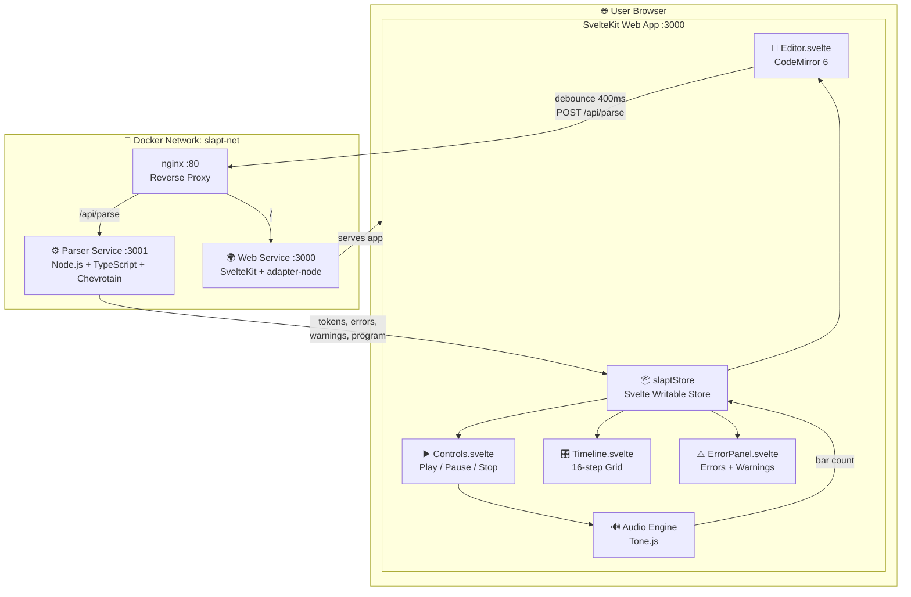
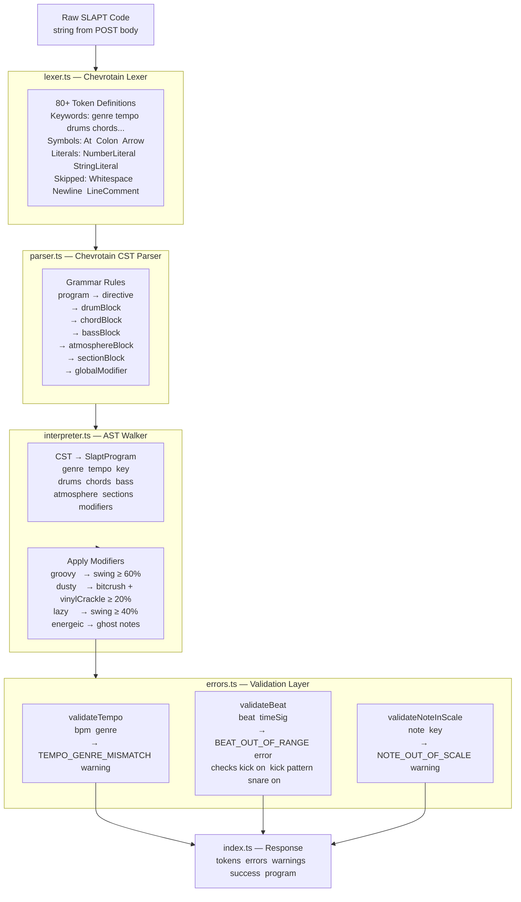
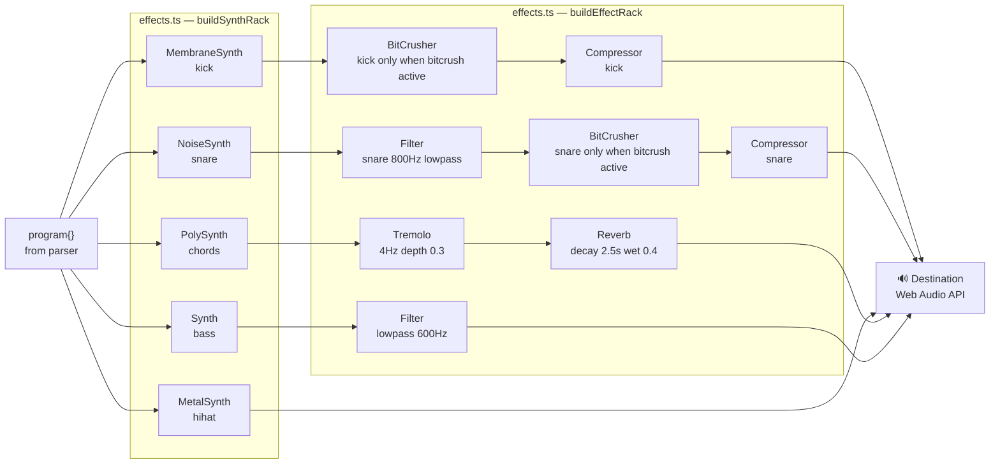
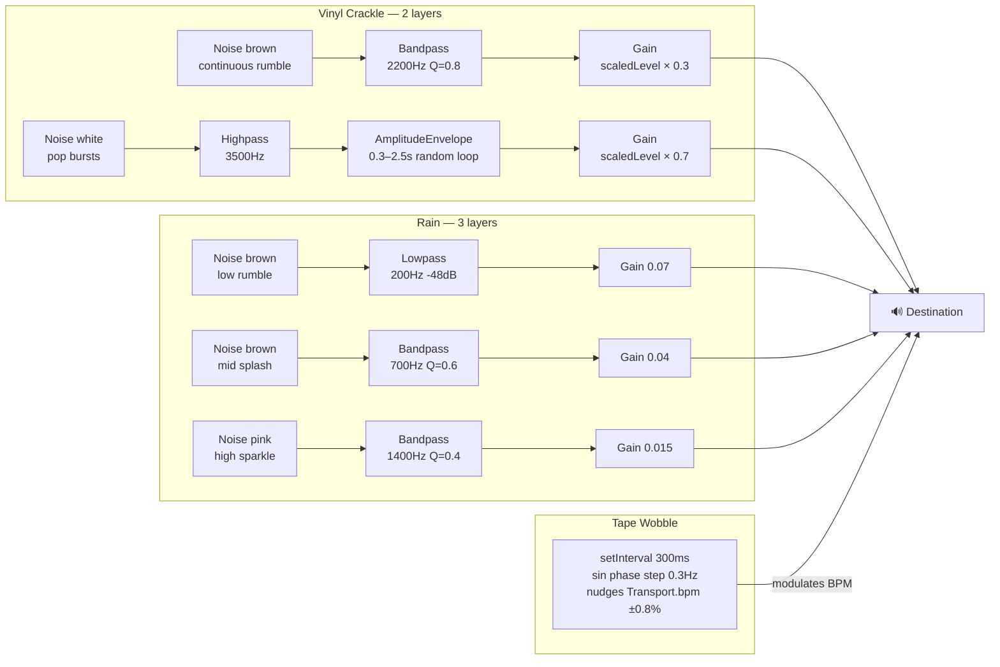
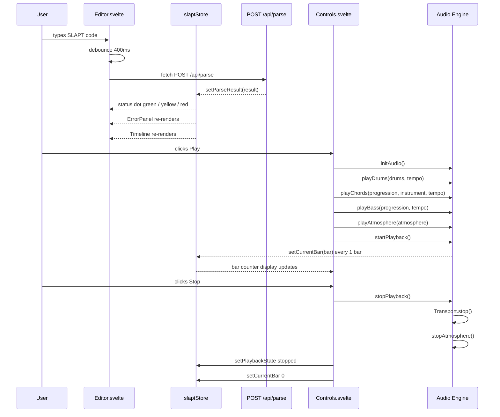
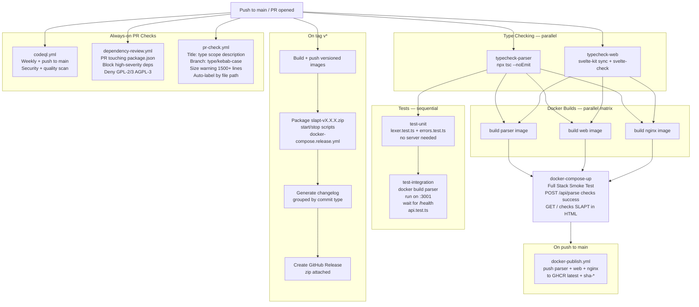

# SLAPT Documentation

> **S**ounds **L**ike **A** **P**erfect **T**rack  
> *(Sonic Language Audio Programming Tool if your parents are asking)*

---

## Table of Contents

1. [Architecture Overview](#architecture-overview)
2. [System Architecture Diagram](#system-architecture-diagram)
3. [Parser Pipeline](#parser-pipeline)
4. [Audio Engine Signal Chain](#audio-engine-signal-chain)
5. [Frontend State Flow](#frontend-state-flow)
6. [CI/CD Pipeline](#cicd-pipeline)
7. [Directory & File Architecture](#directory--file-architecture)
8. [Running SLAPT](#running-slapt)
9. [Parser Service API](#parser-service-api)
10. [Validation Rules](#validation-rules)
11. [SLAPT Language Reference](#slapt-language-reference)
12. [Audio Engine](#audio-engine)
13. [Web Service](#web-service)
14. [CI/CD & GitHub Workflows](#cicd--github-workflows)
15. [Environment Variables](#environment-variables)

---

## Architecture Overview

SLAPT runs as **three Docker services** orchestrated via `docker-compose.yml`. The parser is a stateless REST service. The web frontend does all audio synthesis entirely client-side via Tone.js. nginx is the single entry point.

---

## System Architecture Diagram



---

## Parser Pipeline



---

## Audio Engine Signal Chain

### Drum & Instrument Routing



### Atmosphere Routing



---

## Frontend State Flow



---

## CI/CD Pipeline



---

## Directory & File Architecture

```
SLAPT/
│
├── .env                              # Single root config: ports, PARSER_URL, NODE_ENV
├── docker-compose.yml                # Dev: builds all 3 services from local source
├── docker-compose.release.yml        # Prod: pulls pre-built images from GHCR
├── Taskfile.yml                      # Task runner: docker, dev, install, build,
│                                     #   test, typecheck, health, cleanup commands
├── start.bat / start.sh              # One-click launch scripts for Windows / Mac+Linux
├── stop.bat  / stop.sh               # One-click stop scripts
│
├── .github/
│   ├── labeler.yml                   # Auto-labels PRs by changed file paths
│   │                                 #   parser, web, audio, tests, docs, ci, docker, deps
│   ├── PULL_REQUEST_TEMPLATE.md      # PR checklist: type, how-to-test, task checklist
│   │
│   ├── ISSUE_TEMPLATE/
│   │   ├── bug_report.yml            # Structured bug form: what/error/service/OS/Docker
│   │   └── feature_request.yml      # Feature form: problem/syntax idea/area/roadmap phase
│   │
│   └── workflows/
│       ├── ci.yml                    # Main CI: typecheck → unit tests → integration
│       │                             #   tests → docker builds → full stack smoke test
│       ├── pr-check.yml              # PR gate: title lint, branch name, size warning,
│       │                             #   auto-label via labeler.yml
│       ├── docker-publish.yml        # Builds and pushes all 3 images to GHCR on main
│       ├── release.yml               # On tag v*: versioned images, release zip,
│       │                             #   grouped changelog, GitHub Release
│       ├── codeql.yml                # Weekly + on-push CodeQL security + quality scan
│       └── dependency-review.yml     # On PR: block high-severity, deny GPL licenses
│
├── nginx/
│   ├── Dockerfile                    # FROM nginx:1.25-alpine, copies nginx.conf
│   └── nginx.conf                    # /api/parse → parser:3001, / → web:3000,
│                                     #   WebSocket upgrade headers
│
├── services/
│   │
│   ├── parser/                       # Stateless REST parser service
│   │   ├── Dockerfile                # Multi-stage: tsc compile → slim Alpine runtime
│   │   ├── tsconfig.json             # ES2020, commonjs, strict, sourceMap, declarations
│   │   └── src/
│   │       ├── index.ts              # Express server entry point:
│   │       │                         #   POST /api/parse — lex, parse, validate, build program
│   │       │                         #   GET /health
│   │       │                         #   Beat validation for kick on / kick pattern / snare on
│   │       ├── lexer.ts              # All Chevrotain token definitions (80+ tokens):
│   │       │                         #   keywords, symbols, literals, skipped tokens
│   │       │                         #   longer_alt: Identifier so keywords take priority
│   │       ├── parser.ts             # Chevrotain CST grammar rules:
│   │       │                         #   program, all block types, all sub-rules
│   │       ├── ast.ts                # TypeScript AST node type definitions:
│   │       │                         #   Program, DrumBlock, ChordBlock, BassBlock,
│   │       │                         #   AtmosphereBlock, SectionBlock, ModifierStatement
│   │       ├── interpreter.ts        # Walks CST → SlaptProgram output object,
│   │       │                         #   applies modifier side-effects (swing/bitcrush/crackle)
│   │       └── errors.ts             # validateTempo, validateBeat, validateNoteInScale,
│   │                                 #   GENRE_BPM_RANGES table, SCALE_NOTES table
│   │
│   └── web/
│       ├── Dockerfile                # Multi-stage: svelte-kit sync + vite build → runtime
│       ├── svelte.config.js          # adapter-node, vitePreprocess
│       ├── vite.config.ts            # Port 3000, tone as SSR external
│       ├── tsconfig.json             # ESNext, strict, $lib path alias
│       └── src/
│           ├── app.html              # HTML shell: Google Fonts, SvelteKit body injection
│           ├── app.css               # CSS custom properties: colors, fonts, radius, shadows
│           │
│           ├── types/
│           │   └── slapt.d.ts        # Shared interfaces: ParseResult, SlaptProgram,
│           │                         #   DrumProgramOutput, ChordProgramOutput,
│           │                         #   AtmosphereProgramOutput, SlaptStore, PlaybackState
│           │
│           ├── lib/
│           │   ├── api/
│           │   │   └── parser.ts     # fetch() wrapper: POST /api/parse → ParseResult
│           │   │
│           │   ├── audio/
│           │   │   ├── engine.ts     # Public audio API:
│           │   │   │                 #   initAudio, playDrums, playChords, playBass,
│           │   │   │                 #   playAtmosphere, startPlayback, stopPlayback,
│           │   │   │                 #   pausePlayback, setTempo, cleanup,
│           │   │   │                 #   setBarChangeCallback
│           │   │   │
│           │   │   ├── scheduler.ts  # Tone.js scheduling:
│           │   │   │                 #   scheduleDrums — Tone.Part, swing, velocity
│           │   │   │                 #   scheduleChords — CHORD_VOICINGS map
│           │   │   │                 #   scheduleBass — BASS_ROOTS map
│           │   │   │                 #   scheduleAtmosphere — vinyl (2-layer) + rain (3-layer)
│           │   │   │                 #     + tape wobble (setInterval)
│           │   │   │                 #   startAtmosphere, stopAtmosphere, disposeAtmosphere
│           │   │   │
│           │   │   └── effects.ts    # Tone.js node construction:
│           │   │                     #   buildEffectRack — compressors, reverb, bitcrushers,
│           │   │                     #     tremolo, snareFilter, bassFilter
│           │   │                     #   buildSynthRack — separate chains per instrument
│           │   │                     #   applyDrumEffects — per-instrument bitcrusher routing
│           │   │                     #   disposeEffectRack, disposeSynthRack
│           │   │
│           │   ├── components/
│           │   │   ├── Editor.svelte       # CodeMirror 6: oneDark, line numbers,
│           │   │   │                       #   400ms debounced parse, status dot
│           │   │   ├── Controls.svelte     # Play/pause/stop: reads program from store,
│           │   │   │                       #   wires all engine calls + snareVelocity + atmos
│           │   │   ├── Timeline.svelte     # 16-step grid: decimal beat → step conversion,
│           │   │   │                       #   CSS grid columns, absolute beat label overlays
│           │   │   └── ErrorPanel.svelte   # Errors + warnings: code, line, context,
│           │   │                           #   suggestions, collapsible sections
│           │   │
│           │   └── stores/
│           │       └── slapt.ts      # Svelte writable store:
│           │                         #   state — code, parseResult, playbackState,
│           │                         #     tempo, genre, key, currentBar, isLoading
│           │                         #   setCode extracts genre/key/tempo via regex
│           │                         #   derived — hasErrors, hasWarnings, isPlaying
│           │                         #   INITIAL_CODE — full example lofi-hiphop track
│           │
│           └── routes/
│               ├── +layout.svelte    # Root layout: imports app.css
│               └── +page.svelte      # Main page: topbar, sidebar (genre templates +
│                                     #   quick modifiers), editor, resizable bottom panels
│
└── tests/
    ├── tsconfig.json                 # baseUrl ".." so parser/src imports resolve
    ├── lexer.test.ts                 # Unit: all token types, decimal beats, arrows,
    │                                 #   atmosphere, modifiers, comment skipping
    ├── errors.test.ts                # Unit: validateTempo, validateBeat,
    │                                 #   validateNoteInScale — full edge case coverage
    └── api.test.ts                   # Integration: /health, success, token shapes,
                                      #   warnings, errors, 400 bad request cases
```

---

## Running SLAPT

### Production (One-Click)

Requires [Docker Desktop](https://www.docker.com/products/docker-desktop/).

```bash
# Windows
start.bat

# Mac / Linux
chmod +x start.sh && ./start.sh
```

Opens `http://localhost` automatically.

### Development (Docker)

```bash
docker-compose up --build
```

### Development (No Docker)

```bash
# Terminal 1 — parser
cd services/parser && npm install && npm run dev   # :3001

# Terminal 2 — web
cd services/web && npm install && npm run dev      # :3000
```

Set `PARSER_URL=http://localhost:3001` in `.env` when running without Docker.

### Task Runner Quick Reference

```bash
task              # list all tasks
task run          # build + start (Docker)
task test:full    # start parser → run all tests → stop
task install      # install all deps
task check        # type-check all services
task clean:all    # remove artifacts + volumes
```

---

## Parser Service API

### `POST /api/parse`

**Request:**
```json
{ "code": "your slapt code here" }
```

**Response:**
```json
{
  "tokens": [
    { "tokenType": "Genre", "image": "genre", "startLine": 1, "startColumn": 2 }
  ],
  "errors": [
    {
      "code": "BEAT_OUT_OF_RANGE",
      "message": "Beat 5 doesn't exist in 4/4 time",
      "line": 4,
      "column": 12,
      "context": "kick pattern",
      "suggestions": ["Beats go from 1 to 4 in your current time signature"]
    }
  ],
  "warnings": [
    {
      "code": "TEMPO_GENRE_MISMATCH",
      "message": "180 BPM feels off for lofi-hiphop",
      "suggestions": ["Typical lofi-hiphop range: 60-90 BPM"]
    }
  ],
  "success": true,
  "program": {
    "genre": "lofi-hiphop",
    "tempo": 75,
    "key": "Am",
    "drums": {
      "swing": 60,
      "kick": [1, 2.75, 3],
      "snare": [2, 4],
      "snareVelocity": { "min": 0.7, "max": 0.9 },
      "hihat": { "count": 8, "type": "closed" },
      "effects": ["bitcrush", "compress"]
    },
    "chords": {
      "instrument": "piano",
      "progression": ["Am7", "Fmaj7", "Dm7", "E7"],
      "voicing": "spread",
      "rhythm": "whole",
      "effects": []
    },
    "bass": { "style": "walking", "sound": "mellow", "filter": "warm" },
    "atmosphere": { "vinylCrackle": 20, "rain": true, "tapeWobble": false },
    "modifiers": ["dusty"]
  }
}
```

- `success: true` when `errors` is empty. Warnings do not affect `success`.
- `program` is `null` when there are parse errors.

### `GET /health`

```json
{ "status": "ok", "service": "slapt-parser" }
```

---

## Validation Rules

### Tempo/Genre Mismatch

| Genre | BPM Range |
|---|---|
| lofi-hiphop | 60–90 |
| boom-bap | 80–100 |
| house | 120–135 |
| techno | 130–150 |
| dnb | 160–180 |
| ambient | 60–90 |
| trap | 130–170 |

### Beat Out of Range

Fires an **error** when a beat exceeds the time signature (default 4/4). Validated across all three sources:

```
kick pattern [1, 2.75, 5]  →  BEAT_OUT_OF_RANGE  (context: "kick pattern")
snare on 2 and 6           →  BEAT_OUT_OF_RANGE  (context: "snare on")
kick on 5                  →  BEAT_OUT_OF_RANGE  (context: "kick on")
```

### Note Out of Scale

| Key | Scale Notes |
|---|---|
| Am | A B C D E F G |
| Cm | C D Eb F G Ab Bb |
| Dm | D E F G A Bb C |
| Em | E F# G A B C D |
| C  | C D E F G A B |
| G  | G A B C D E F# |
| F  | F G A Bb C D E |

---

## SLAPT Language Reference

### Directives

```
@genre lofi-hiphop
@tempo 75 bpm
@key Am
```

Must appear at the top. Genre sets defaults for tempo and key if not explicitly declared.

### Drum Block

```
drums with swing(60%):
  kick pattern [1, 2.75, 3]
  kick on 1 and 3
  snare on 2 and 4
  snare velocity random(0.7 to 0.9)
  hihat closed 8 times
  apply bitcrush(10bit)
  compress heavily
```

| Statement | Behaviour |
|---|---|
| `kick pattern [...]` | Decimal beat positions — every value validated |
| `kick on X and Y` | Shorthand beats — `kick on 1 and 3 and 4` is valid |
| `snare on X and Y` | Same. No line = no snare plays |
| `snare velocity random(min to max)` | Per-hit velocity 0.0–1.0. Default: `0.6 to 0.8` |
| `hihat N times` | Divides bar into N equal hits. No line = no hihat |
| `swing(N%)` | Shifts every other 8th note by N% |

### Chord Block

```
chords using rhodes piano:
  progression Am7 -> Fmaj7 -> Dm7 -> E7
  voicing spread
  rhythm whole notes with slight anticipation
  reverb(medium, dreamy)
  tremolo(gentle, 4Hz)
```

Built-in voicings: `Am7`, `Fmaj7`, `Dm7`, `E7`, `Cmaj7`, `Gmaj7`, `Am`, `Dm`, `Em`

### Bass Block

```
bass walking the roots:
  follow chord progression
  sound mellow
  filter warm
```

### Atmosphere Block

```
atmosphere:
  vinyl crackle at 20% volume
  rain sounds softly in background
  tape wobble subtle
```

| Layer | Implementation |
|---|---|
| **Vinyl crackle** | Brown noise → bandpass 2200Hz (hum) + white noise bursts via Tone.Loop at random 0.3–2.5s → highpass 3500Hz → AmplEnvelope |
| **Rain** | Brown → lowpass 200Hz + brown → bandpass 700Hz + pink → bandpass 1400Hz |
| **Tape wobble** | `setInterval(300ms)` nudges `Transport.bpm` ±0.8% on a 0.3Hz sine |

All layers start and stop with playback.

### Global Modifiers

| Modifier | Effect |
|---|---|
| `make it groovy` | Swing ≥ 60%, humanization, ghost notes |
| `make it dusty` | Bitcrush on drums, vinyl crackle ≥ 20% (auto-creates atmosphere if absent) |
| `add some laziness` | Swing ≥ 40%, pushed-back timing |
| `bring energy up` | Increased velocity, fills every 4 bars |

Modifiers stack freely.

---

## Audio Engine

### Playback Flow

| Step | Call | What happens |
|---|---|---|
| 1 | `initAudio()` | Creates synths + effects — must be called after a user gesture |
| 2 | `playDrums(pattern, tempo)` | Builds drum `Tone.Part`, applies per-instrument bitcrusher routing |
| 3 | `playChords(progression, instrument, tempo)` | Builds chord `Tone.Part` from `CHORD_VOICINGS` map |
| 4 | `playBass(progression, tempo)` | Builds bass `Tone.Part` from `BASS_ROOTS` map |
| 5 | `playAtmosphere(atmos)` | Builds atmosphere nodes — does **not** start them yet |
| 6 | `startPlayback()` | `Transport.start()` + `startAtmosphere()` + schedules bar counter |
| 7 | `stopPlayback()` | `Transport.stop()` + cancel events + explicit `stopAtmosphere()` |
| 8 | `pausePlayback()` | `Transport.pause()` + explicit `stopAtmosphere()` |
| 9 | `cleanup()` | Disposes all Tone nodes — call on component destroy |

> **Important:** Atmosphere nodes are free-running `Tone.Noise` instances. `Transport.stop()` alone does **not** stop them — `stopAtmosphere()` must be called explicitly.

### Snare Velocity

```typescript
// Parsed from: snare velocity random(0.7 to 0.9)
snareVelocity: { min: 0.7, max: 0.9 }

// Used by scheduler:
const velocity = velMin + Math.random() * (velMax - velMin);
```

Default when no velocity line is written: `{ min: 0.6, max: 0.8 }`.

---

## Web Service

### Stores (`src/lib/stores/slapt.ts`)

| Store | Type | Description |
|---|---|---|
| `code` | `string` | Current editor content |
| `parseResult` | `ParseResult \| null` | Latest parse response including `program` |
| `playbackState` | `stopped \| playing \| paused` | Transport state |
| `tempo` | `number` | Current BPM — extracted from code via regex on every edit |
| `genre` | `string` | Current genre — extracted from code |
| `key` | `string` | Current key — extracted from code |
| `currentBar` | `number` | Bar counter from audio engine |
| `isLoading` | `boolean` | Parse request in flight |

Derived stores: `hasErrors`, `hasWarnings`, `isPlaying`

### Components

| Component | Responsibility |
|---|---|
| `Editor.svelte` | CodeMirror 6 — oneDark, line numbers, 400ms debounced parse, status dot |
| `Controls.svelte` | Play/pause/stop — reads `program` from store, wires all engine calls |
| `Timeline.svelte` | 16-step grid — decimal beat support, CSS grid equal columns, absolute beat labels |
| `ErrorPanel.svelte` | Errors (code + line + context + suggestions) and warnings |

---

## CI/CD & GitHub Workflows

| Workflow | Trigger | What it does |
|---|---|---|
| `ci.yml` | Push/PR to main or develop | Typecheck → unit tests → integration tests → docker builds → smoke test |
| `pr-check.yml` | PR open/edit/sync | Title lint, branch name lint, size warning at 1500+ lines, auto-label |
| `docker-publish.yml` | Push to main | Builds and pushes all 3 images to GHCR with `latest` + `sha-*` tags |
| `release.yml` | Push tag `v*` | Versioned images, release zip, grouped changelog, GitHub Release |
| `codeql.yml` | Push to main + weekly | CodeQL security + quality analysis for TypeScript |
| `dependency-review.yml` | PR touching package.json | Blocks high-severity deps, denies GPL-2/3 and AGPL-3 |

**PR title:** `type(scope): description` — types: `add` `fix` `docs` `refactor` `test` `chore` `perf` `ci`  
**Branch:** `type/description-in-kebab-case`

---

## Environment Variables

All variables live in a **single `.env`** at project root. No per-service env files.

| Variable | Service | Default | Description |
|---|---|---|---|
| `NGINX_PORT` | nginx | `80` | Nginx listen port |
| `WEB_PORT` | web | `3000` | SvelteKit service port |
| `PARSER_PORT` | parser | `3001` | Parser service port (also exposed to host for tests) |
| `NODE_ENV` | both | `production` | Node environment |
| `PARSER_URL` | web | `http://parser:3001` | Parser base URL — change to `http://localhost:3001` for dev without Docker |